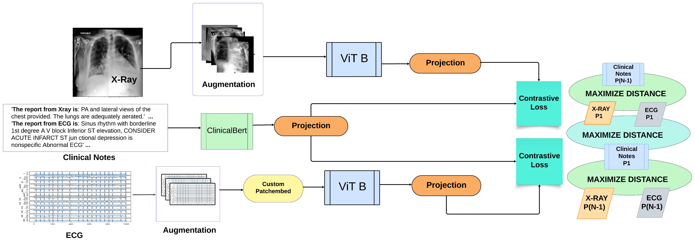

## Please Cite this work as:
@article{thapa2024more,
  title={MoRE: Multi-Modal Contrastive Pre-training with Transformers on X-Rays, ECGs, and Diagnostic Report},
  author={Thapa, Samrajya and Howlader, Koushik and Bhattacharjee, Subhankar and others},
  journal={arXiv preprint arXiv:2410.16239},
  year={2024}
}

# MoRE: MultiModal Contrastive Pretraining of X-ray, ECG, and Report



MoRE is a pretraining framework which synergestically aligns Xray, ECG, and Diagnostic Report of same patient with Contrastive Learning. The Clinical Report (Cardiology Report and Radiology Report) are combined together and acts an anchor to align the Xray and ECG in a multimodal space, we show this via Multi-Modal Retrieval by retrieving Xray and ECG data via a single text query (refer to Section 4.6.3 MultiModal Retrieval in Paper), we also adapt TransLRP to show multimodal attention visualization to provide explanation of multimodal input for diagnosis (refer to section 4.6.3 Gradient Based LRP attention visualization). MoRE beats baseline GLoRIA, MedKLIP in Mimic IV Xray dataset on 4 labels (Atelectasis, Cardiomegaly, Edema, Effusion) and beats baselines in PtbXL ECG dataset for superclass labels. MoRE outperforms its baselines in Zero-shot classification as well showcasing its strong representation learning capability. MoRE also utilizes PEFT LoRA strategy to fine-tune the LLM during pre-training effectively only training 0.6% of original parameters of the LLM significantly reducing training time. 

## Setting up the Environment

1. **Create a virtual environment**:
   ```bash
   python -m venv myenv
   ```

2. **Install the required dependencies**:
   ```bash
   pip install -r requirements.txt
   ```

## Pre-Train MoRE

1. **Download the required datasets** from Physionet (datasets are not attached due to credential requirements for data signing).
   
2. **Add the datasets** to the appropriate folder.

3. **Preprocess the data** (preprocessing code is included).

4. **Run the pretraining script**:
   ```bash
   python pretrain_multimodel.py
   ```
   Add arguments as needed; default settings are provided.

## Fine-tune in Mimic/Chexpert

1. **Ensure that the pre-trained model is saved**.

2. **Run the fine-tuning script**:
   ```bash
   python multimodal_infer.py
   ```
   Make sure to change the data paths and model paths as needed.

## Zero-Shot Classification

1. **Run the zero-shot classification script**:
   ```bash
   python zero_shot_xray/ecg_more.py
   ```
   Update data paths or parameters as necessary.

## Retrieval Tasks

1. **Check the `xray_ecg_retrieval.ipynb` notebook** for an example of multimodal retrieval.

2. **Run the X-ray retrieval script**:
   ```bash
   python xray_retrieval.py
   ```

## t-SNE Plot

1. **Check the `tnse_plot.ipynb` notebook** for an example of a t-SNE plot of features.

